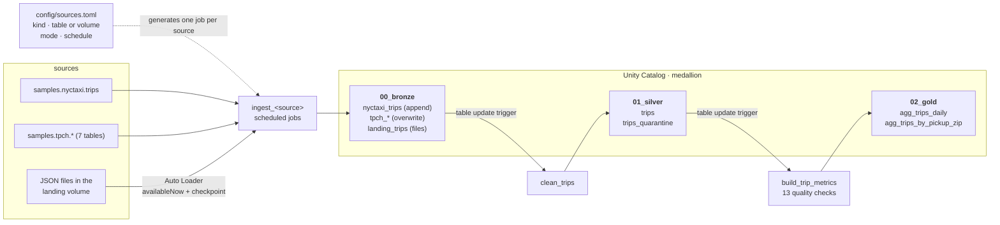

# databricks-pyspark-delta-medallion

[](https://github.com/matiastulli/databricks-pyspark-delta-medallion/actions/workflows/ci.yml)


A lakehouse on Databricks. **PySpark** moves data through **bronze → silver → gold** layers stored as **Delta Lake** tables in **Unity Catalog**. Every process is its own workflow, defined as code with **Databricks Asset Bundles**: ingestion runs on per-source schedules, silver and gold react to table updates, and the logic is unit-tested in CI on local PySpark. It all runs on Databricks **Free Edition** (serverless only).

It uses the sample data that ships with every Databricks workspace: [NYC taxi trips](https://docs.databricks.com/aws/en/discover/databricks-datasets) (`samples.nyctaxi.trips`) and seven TPC-H tables (`samples.tpch.*`).

It was built one step at a time. The plan, the decisions and what each step verified on the workspace are in [docs/PLAN.md](docs/PLAN.md).

## Architecture



| Layer | `src/` folder | Unity Catalog schema | Contents |
|---|---|---|---|
| Bronze | `src/00_bronze/` | `medallion.00_bronze` | Sources copied as is, plus `_batch_id`, `_ingested_at`, `_source_table`, `_source_file`. Tables are copied in full; files in the `landing` volume are picked up incrementally by Auto Loader |
| Silver | `src/01_silver/` | `medallion.01_silver` | `trips`: deduplicated, validated, typed; `trips_quarantine`: rejected trips with their reasons |
| Gold | `src/02_gold/` | `medallion.02_gold` | `agg_trips_daily` (built incrementally from silver's change feed), `agg_trips_by_pickup_zip` (a ranking, rebuilt in full) |
| Ops | `src/ops/` | `medallion.ops` | `apply_ddl` applies DDL migrations and records them in `schema_migrations`; `maintain_tables` runs the weekly `OPTIMIZE` / `VACUUM`; `processed_versions` holds the incremental watermarks |

## What this project shows

**PySpark + Delta Lake**
- **Append vs. snapshot ingestion:** each source declares a load `mode`. `nyctaxi_trips` appends a batch per run and keeps the full load history. The TPC-H reference tables `overwrite` a full snapshot, which is atomic and keeps storage flat.
- **A key when the source has none:** `trip_id` is a SHA-256 of the source columns, with timestamps hashed as epoch microseconds so the key doesn't change with the session time zone.
- **Idempotent `MERGE`:** silver merges on `trip_id`, insert-only, because a matching key means identical content. Rerunning inserts 0 rows, and the Delta history shows it.
- **Quarantine instead of silent drops:** rejected trips keep their raw values plus `rejection_reasons` (missing value, distance or fare ≤ 0, dropoff not after pickup). Every trip lands in exactly one of silver or quarantine, and the run checks that.
- **Explicit types:** silver tables declare `NOT NULL` columns and comments in their DDL. Fares become `DECIMAL(10,2)` and ZIPs 5-character strings (`7002` → `07002`).

**Data quality**
- **Compute → check → write** for a full rebuild: the 13 checks run before anything is published (silver's contract, one row per key, and **reconciliation** of trips and revenue with silver).
- **Write → check → roll back** for an incremental merge, because the result only exists once merged: the job notes gold's version, merges, checks, and on failure runs `RESTORE TABLE … TO VERSION AS OF`. Either way a bad aggregate never stays published, and the watermark only moves after the checks pass.
- Proven by breaking it on purpose: a gold date deleted by hand made reconciliation fail (`got 21475, expected 21833`), the run failed, and gold came back at its pre-run values.

**Tables as code: DDL migrations**
- **Jobs never create tables.** Every published table is defined by write-once SQL in its schema's folder, e.g. `src/01_silver/ddl/silver_trips_v001_create.sql`, then `silver_trips_v002_alter.sql`. Versions are counted per table, and the `apply_ddl` workflow applies the pending ones and records them in `ops.schema_migrations`.
- **A small in-repo runner** ([`migrations.py`](src/medallion/migrations.py), unit-tested): schemas first, then layer folders, tables and versions, with renames after the table they rename. It refuses an applied migration that was edited or deleted, and misplaced, misnamed, duplicate or missing versions.
- **Adopted without rewriting anything:** the baseline migrations reproduce the 12 existing tables exactly (117 columns: types, `NOT NULL`, comments; checked against a fresh catalog). Applying them left every table's Delta version and row count unchanged.
- **A naming convention, applied through migrations:** bronze `<source_system>_<source_table>` (derived from the config), silver plural entities, gold `fct_` / `dim_` / `agg_<subject>_<grain>`. Three tables were renamed with `ALTER TABLE … RENAME TO`, and their data, history and comments moved with them.
- **A write contract:** before writing, every job checks that its DataFrame matches the table's columns and types exactly. Delta rejects extra columns, `NOT NULL` violations and impossible casts, but on Databricks it silently accepted a missing nullable column (filled with null), so the jobs check first.

**Delta layout and maintenance, measured**
- **Liquid clustering:** `00_bronze.tpch_orders` is `CLUSTER BY (o_orderdate)`, set in a migration. Measured with [`scripts/measure_pruning.py`](scripts/measure_pruning.py): a date filter went from reading **3 of 3 files (nothing pruned)** to **1 of 2 files, 35.7 MB pruned**. On a 165 MB table that saves under a second; the point is the mechanism and the measurement.
- **Optimized writes and auto compaction** on the tables written every run, with each migration explaining that one acts before the write and the other after the commit.
- **A weekly [`maintain_tables`](resources/maintain_tables_job.yml) workflow:** `OPTIMIZE` (the only operation that re-clusters), optional `REORG TABLE … APPLY (PURGE)` to materialize deletion vectors, and `VACUUM` in dry run by default, since it shortens time travel. It reports files, size and clustering before and after.
- **What Databricks already does here:** these are Unity Catalog managed tables, so deletion vectors are on by default and **predictive optimization already runs `OPTIMIZE`** (241k rows sat in one file before this step). No partitioning and no Z-order: both are the wrong tool at this size, and Z-order can't coexist with liquid clustering.

**Incremental processing with Change Data Feed**
- **Silver records its changes** (`delta.enableChangeDataFeed`), and gold reads only the versions after its watermark in `ops.processed_versions`, rebuilding just the dates that moved and merging them.
- **Deletes count too:** the keys come from every change type, so a date whose trips were removed is recomputed rather than left counting rows that are gone.
- **A ranking can't be incremental:** `agg_trips_by_pickup_zip` is rebuilt in full, because one changed trip can move many ZIPs.
- **Measured on the workspace:** deleting one date's 357 trips made a run rebuild exactly **1 date** (60 → 59 rows); restoring them rebuilt exactly 1 again; an unchanged silver makes the run do nothing at all.
- **Retries are safe:** a failed task is retried automatically on serverless, and each attempt rolled itself back (`MERGE`, `RESTORE`, `MERGE`, `RESTORE` in the table history) without double-applying anything.

**File ingestion: Auto Loader and checkpoints**
- **Two kinds of source, one config.** `kind = "table"` is copied in full; `kind = "files"` is read incrementally from a Unity Catalog volume with Auto Loader. The job for each is generated the same way.
- **`trigger(availableNow=True)`:** the same streaming code run as a batch job on a schedule, keeping its checkpoint, so each run starts exactly where the last one stopped.
- **Proven incremental, on the workspace:** 3 days of files → 940 rows; rerun with nothing new → **0 rows**; 2 more days land → **684 rows**, only the new files. The run output lists the checkpoint's `offsets/`, `commits/`, `sources/`.
- **The schema comes from the target table**, not from inference, so a file that stops matching the DDL fails the run instead of changing the table.

**Databricks workflows as code** ([`databricks.yml`](databricks.yml), [`resources/`](resources))
- **One workflow per process:** eight `ingest_<source>` jobs (daily, twice a month, monthly), `clean_trips` (silver) and `build_trip_metrics` (the gold scorecard).
- **Generated jobs:** [`resources/__init__.py`](resources/__init__.py) uses Python-defined bundle resources to create one ingestion job per entry in [`config/sources.toml`](config/sources.toml). Adding bronze table #41 is a config entry: no notebook, no job YAML.
- **Event-driven downstream:** silver and gold start on **table update triggers** on their input tables, instead of guessing when bronze finished. Triggers fire only on real data changes, so a silver run that inserts nothing doesn't rebuild gold.
- **Safe dev target:** development mode prefixes job names with the user and pauses every schedule and trigger, so nothing spends Free Edition quota on its own.

**Tests and CI** ([.github/workflows/ci.yml](.github/workflows/ci.yml))
- **Thin notebooks, tested logic:** all transformations live in [`src/medallion/`](src/medallion) as pure DataFrame functions. The notebooks only read, call, write and orchestrate.
- **62 pytest tests** on local PySpark, with no workspace: key stability, first load wins, the silver/quarantine split, typing, aggregates, quality checks, edge cases (nulls, empty inputs), the write contract, the migration runner (order, drift, naming), and validation of the sources config. One edge-case test caught a real bug: a trip with a null value passed validation, because `null <= 0` is null, not true.
- **CI on GitHub, CD from the laptop:** every push runs the tests. Deploys are `databricks bundle deploy` with OAuth, so GitHub holds no Databricks credentials.

## Project structure

```
├── config/
│   └── sources.toml              bronze sources: kind (table | files), load mode, schedule
├── resources/
│   ├── __init__.py               generates one ingest_<source> job per config entry
│   ├── apply_ddl_job.yml         applies pending DDL migrations
│   ├── maintain_tables_job.yml   weekly Delta maintenance
│   ├── clean_trips_job.yml       silver workflow (table update trigger)
│   └── build_trip_metrics_job.yml  gold scorecard workflow (table update trigger)
├── src/
│   ├── 00_bronze/
│   │   ├── ingest.py             one generic notebook for every table source
│   │   ├── ingest_files.py       Auto Loader: files from the landing volume
│   │   ├── seed_landing_files.py drops JSON files in the volume, standing in for an external system
│   │   └── ddl/                  schemas_v001_create.sql, bronze_<table>_v001_create.sql, …_v001_rename.sql
│   ├── 01_silver/
│   │   ├── clean_trips.py
│   │   └── ddl/                  silver_trips_v001_create.sql, …
│   ├── 02_gold/
│   │   ├── build_trip_metrics.py  incremental from silver's change feed
│   │   └── ddl/                  gold_…_v001_create.sql, …_to_agg_…_v001_rename.sql
│   ├── ops/
│   │   ├── apply_ddl.py          the migration runner
│   │   ├── maintain_tables.py    OPTIMIZE / REORG / VACUUM, weekly
│   │   └── ddl/                  ops_processed_versions_v001_create.sql
│   └── medallion/                sources, bronze, silver, gold, quality, contract, migrations, maintenance: the tested logic
├── tests/                        pytest on local PySpark
├── scripts/
│   ├── setup_unity_catalog.sh    the catalog (one-off)
│   ├── new_bronze_migration.py   generates a bronze table's DDL from its source schema
│   └── measure_pruning.py        files read vs pruned for a query
├── docs/PLAN.md                  the learning path, decisions and verifications
├── .github/workflows/ci.yml
├── databricks.yml · pyproject.toml
└── requirements.txt · .env.example
```

Folders under `src/` match the schema each process writes to, and files are named after what the process does.

---

## Setup from scratch

Requirements: a [Databricks Free Edition](https://www.databricks.com/learn/free-edition) workspace, the Databricks CLI (e.g. `brew install databricks`), Python 3.11 and Java 17 (for local PySpark).

```sh
# 1. Python env: PySpark + Delta for tests, databricks-bundles to generate the jobs
python3 -m venv .venv
source .venv/bin/activate
pip install -r requirements.txt

# 2. Workspace settings: copy the template and set DATABRICKS_HOST (.env is gitignored)
cp .env.example .env
set -a; source .env; set +a

# 3. Log in with browser OAuth (no personal access token)
databricks auth login --host "$DATABRICKS_HOST"

# 4. Unity Catalog: the medallion catalog (Free Edition can't create it through the API)
scripts/setup_unity_catalog.sh

# 5. Deploy every workflow, create the schemas and tables from the DDL migrations, then run the pipeline once by hand
databricks bundle deploy
databricks bundle run apply_ddl
databricks bundle run ingest_nyctaxi_trips
databricks bundle run clean_trips
databricks bundle run build_trip_metrics
```

> **Why a script for the catalog?** On Free Edition, `databricks catalogs create` fails because the metastore has no storage root. The script runs `CREATE CATALOG` as SQL on the serverless warehouse instead, which puts the catalog on Default Storage.

## Every new terminal

```sh
source .venv/bin/activate && set -a && source .env && set +a   # run from the repo root
export JAVA_HOME=$(/usr/libexec/java_home -v 17)               # only needed for pytest
```

---

## Asset Bundle commands

### Deploy and run

| Command | What it does |
|---|---|
| `databricks bundle validate` | Check `databricks.yml` + `resources/`, including the Python job generator |
| `databricks bundle validate -o json` | The fully resolved config: generated jobs, schedules, triggers, pause status |
| `databricks bundle plan` | Preview what a deploy would create, change or delete |
| `databricks bundle deploy` | Upload files and create/update every job (the `dev` target is the default) |
| `databricks bundle summary` | List what's deployed |
| `databricks bundle run ingest_nyctaxi_trips` | Run a job and wait. Prints the notebook's exit JSON and fails if the run fails |
| `databricks bundle run ingest_nyctaxi_trips --params catalog=my_catalog` | Override job parameters for one run |
| `databricks bundle run clean_trips --no-wait` | Start a run without waiting |
| `databricks bundle open clean_trips` | Open the job in the browser |

### Add a bronze table

1. Add a `[[sources]]` entry to [`config/sources.toml`](config/sources.toml): `table`, `mode` (`append` / `overwrite`), `schedule` (Quartz cron, UTC). The bronze table and job names are derived: `samples.tpch.lineitem` → `tpch_lineitem`, `ingest_tpch_lineitem`.
2. `.venv/bin/python scripts/new_bronze_migration.py tpch_lineitem`: writes `src/00_bronze/ddl/bronze_tpch_lineitem_v001_create.sql` from the source's real schema. Review it.
3. `.venv/bin/pytest tests/test_sources.py tests/test_migrations.py`: the config and the migrations must pass validation (CI checks them too).
4. `databricks bundle deploy`, then `databricks bundle run apply_ddl` to create the table, then run `ingest_<name>`.

### DDL migrations

| Command | What it does |
|---|---|
| `databricks bundle run apply_ddl --params dry_run=true` | List pending migrations without executing them |
| `databricks bundle run apply_ddl` | Apply pending migrations in order and record them in `ops.schema_migrations`; a rerun does nothing |
| `databricks bundle run build_trip_metrics --params full_rebuild=true` | Ignore the watermark and rebuild every date, e.g. after changing an aggregation |
| `databricks bundle run seed_landing_files --params days=5` | Drop JSON files in the landing volume; dates already written are left alone |
| `databricks bundle run ingest_landing_trips` | Auto Loader: ingests only files it hasn't seen; a rerun ingests 0 rows |
| `databricks bundle run maintain_tables` | `OPTIMIZE` + `VACUUM` dry run over every table; `--params optimize_full=true` re-clusters, `vacuum=run` really deletes |
| `.venv/bin/python scripts/measure_pruning.py "<query>"` | Files read vs pruned for a query, from query history |
| `.venv/bin/python scripts/new_bronze_migration.py <name>` | Generate a bronze table's `…_v001_create.sql` from its source schema (`--dry-run` prints it) |

Change a table by adding its next version, e.g. `src/02_gold/ddl/gold_agg_trips_daily_v002_alter.sql`. **Never edit an applied migration:** the runner refuses to continue until the file matches what ran.

### Jobs and runs

| Command | What it does |
|---|---|
| `databricks jobs list` | Every job in the workspace, with IDs |
| `databricks jobs list-runs --job-id <id> --limit 5` | Recent runs. `trigger` shows `PERIODIC`, `TABLE` or `ONE_TIME` |
| `databricks jobs get-run <run_id>` | Run details and per-task state |
| `databricks jobs get-run-output <task_run_id>` | A task's notebook exit value, or its error |

### Unity Catalog and SQL

| Command | What it does |
|---|---|
| `scripts/setup_unity_catalog.sh` | Create the catalog (idempotent, reads `.env`). Schemas and tables come from migrations |
| `databricks schemas list medallion` | Schemas in the catalog |
| `databricks tables list medallion 00_bronze` | Tables in a schema |
| `databricks tables get medallion.01_silver.trips` | Columns, types and comments |
| `databricks warehouses stop "$DATABRICKS_WAREHOUSE_ID" --no-wait` | Stop the SQL warehouse after ad-hoc SQL to save quota |

Useful in the SQL editor: `DESCRIBE HISTORY medallion.01_silver.trips` (what each `MERGE` inserted) · `SELECT * FROM medallion.01_silver.trips_quarantine` (why trips were rejected) · `SELECT * FROM medallion.00_bronze.tpch_orders VERSION AS OF 2` (time travel to an earlier snapshot)

### Danger zone

| Command | Why be careful |
|---|---|
| Unpausing a schedule or trigger | Jobs then run on their own and spend Free Edition quota. In `dev` they're paused by design |
| `databricks bundle destroy` | Deletes every deployed job and the bundle's workspace files. The tables stay, because the bundle doesn't manage them |
| `DROP SCHEMA medallion.00_bronze CASCADE` | Drops bronze with its whole load history, which can't be re-created with the same batches |
| Editing or deleting an applied migration | `apply_ddl` refuses to run until the file matches its recorded checksum again. Write a new version instead |
| `DELETE FROM medallion.ops.schema_migrations` | The runner would re-apply migrations that already ran, e.g. renames of tables that no longer have the old name |
| Adding `samples.tpch.lineitem` | 30M rows copied on every run: left out on purpose |

---

## Tests

```sh
.venv/bin/pytest                                     # all 62 tests, ~7 s
.venv/bin/pytest tests/test_silver.py                # one file
.venv/bin/pytest -k time_zone                        # by name
```

Tests use plain local Spark (no Delta, no workspace): `pyproject.toml` puts `src/` on the path and points pytest at `tests/`.

---

## Coming from dbt

The same medallion idea as [dbt-terraform-postgres-medallion](https://github.com/matiastulli/dbt-terraform-postgres-medallion), built with PySpark and Databricks instead:

| dbt | Here |
|---|---|
| `models/00_bronze`, `01_silver`, `02_gold` folders | `src/00_bronze/`, `01_silver/`, `02_gold/`, one folder per schema |
| `_sources.yml` | `config/sources.toml`, which also generates the ingestion jobs |
| Model `config(materialized=...)` creates the relation | Versioned DDL migrations per table (`src/<NN_layer>/ddl/`), applied by `apply_ddl` |
| The DAG from `ref()` | Table update triggers: each workflow runs when its input tables change |
| `materialized: incremental` + `unique_key` | Delta `MERGE` on `trip_id` (insert-only) |
| Snapshots (SCD2) | Append-only bronze batches plus Delta time travel (`VERSION AS OF`) |
| `data_tests` + singular SQL tests | Gold quality checks that fail the run, plus pytest on the logic |
| `var()` / `--vars` | Bundle variables and job parameters (`--params`) |
| Macros | Python functions in `src/medallion/` |
| `dbt build` in CI | pytest in CI; `databricks bundle deploy` from the laptop |
| Scheduling (not in dbt-core) | Built in: a Quartz schedule per ingestion job |
