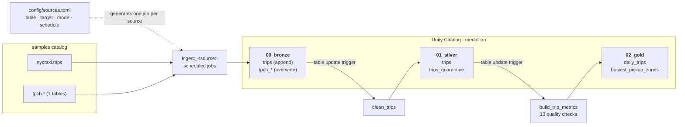

# databricks-pyspark-delta-medallion

[](https://github.com/matiastulli/databricks-pyspark-delta-medallion/actions/workflows/ci.yml)


A lakehouse on Databricks. **PySpark** moves data through **bronze → silver → gold** layers stored as **Delta Lake** tables in **Unity Catalog**. Every process is its own workflow, defined as code with **Databricks Asset Bundles**: ingestion runs on per-source schedules, silver and gold react to table updates, and the logic is unit-tested in CI on local PySpark. It all runs on Databricks **Free Edition** (serverless only).

It uses the sample data that ships with every Databricks workspace: [NYC taxi trips](https://docs.databricks.com/aws/en/discover/databricks-datasets) (`samples.nyctaxi.trips`) and seven TPC-H tables (`samples.tpch.*`).

It was built one step at a time. The plan, the decisions and what each step verified on the workspace are in [docs/PLAN.md](docs/PLAN.md).

## Architecture



| Layer | `src/` folder | Unity Catalog schema | Contents |
|---|---|---|---|
| Bronze | `src/00_bronze/` | `medallion.00_bronze` | Sources copied as is, plus `_batch_id`, `_ingested_at`, `_source_table`, `_source_file` |
| Silver | `src/01_silver/` | `medallion.01_silver` | `trips`: deduplicated, validated, typed; `trips_quarantine`: rejected trips with their reasons |
| Gold | `src/02_gold/` | `medallion.02_gold` | `daily_trips`, `busiest_pickup_zones`: the trip scorecard |

## What this project shows

**PySpark + Delta Lake**
- **Append vs. snapshot ingestion:** each source declares a load `mode`. `trips` appends a batch per run and keeps the full load history. The TPC-H reference tables `overwrite` a full snapshot, which is atomic and keeps storage flat.
- **A key when the source has none:** `trip_id` is a SHA-256 of the source columns, with timestamps hashed as epoch microseconds so the key doesn't change with the session time zone.
- **Idempotent `MERGE`:** silver merges on `trip_id`, insert-only, because a matching key means identical content. Rerunning inserts 0 rows, and the Delta history shows it.
- **Quarantine instead of silent drops:** rejected trips keep their raw values plus `rejection_reasons` (missing value, distance or fare ≤ 0, dropoff not after pickup). Every trip lands in exactly one of silver or quarantine, and the run checks that.
- **Explicit types:** silver tables are created up front with `NOT NULL` columns and comments. Fares become `DECIMAL(10,2)` and ZIPs 5-character strings (`7002` → `07002`).

**Data quality**
- **Compute → check → write:** gold runs 13 checks on the new aggregates before publishing: silver's contract, one row per key, and **reconciliation** of trips and revenue with silver. Any failure raises `DataQualityError` listing every failed check, and gold keeps its last good version.

**Databricks workflows as code** ([`databricks.yml`](databricks.yml), [`resources/`](resources))
- **One workflow per process:** eight `ingest_<source>` jobs (daily, twice a month, monthly), `clean_trips` (silver) and `build_trip_metrics` (the gold scorecard).
- **Generated jobs:** [`resources/__init__.py`](resources/__init__.py) uses Python-defined bundle resources to create one ingestion job per entry in [`config/sources.toml`](config/sources.toml). Adding bronze table #41 is a config entry: no notebook, no job YAML.
- **Event-driven downstream:** silver and gold start on **table update triggers** on their input tables, instead of guessing when bronze finished. Triggers fire only on real data changes, so a silver run that inserts nothing doesn't rebuild gold.
- **Safe dev target:** development mode prefixes job names with the user and pauses every schedule and trigger, so nothing spends Free Edition quota on its own.

**Tests and CI** ([.github/workflows/ci.yml](.github/workflows/ci.yml))
- **Thin notebooks, tested logic:** all transformations live in [`src/medallion/`](src/medallion) as pure DataFrame functions. The notebooks only read, call, write and orchestrate.
- **23 pytest tests** on local PySpark, with no workspace: key stability, first load wins, the silver/quarantine split, typing, aggregates, quality checks, edge cases (nulls, empty inputs), and validation of the sources config. One edge-case test caught a real bug: a trip with a null value passed validation, because `null <= 0` is null, not true.
- **CI on GitHub, CD from the laptop:** every push runs the tests. Deploys are `databricks bundle deploy` with OAuth, so GitHub holds no Databricks credentials.

## Project structure

```
├── config/
│   └── sources.toml              bronze sources: table, target, load mode, schedule
├── resources/
│   ├── __init__.py               generates one ingest_<source> job per config entry
│   ├── clean_trips_job.yml       silver workflow (table update trigger)
│   └── build_trip_metrics_job.yml  gold scorecard workflow (table update trigger)
├── src/
│   ├── 00_bronze/ingest.py       one generic notebook for every source
│   ├── 01_silver/clean_trips.py
│   ├── 02_gold/build_trip_metrics.py
│   └── medallion/                sources, bronze, silver, gold, quality: the tested logic
├── tests/                        pytest on local PySpark
├── scripts/setup_unity_catalog.sh  catalog + schemas (one-off)
├── docs/PLAN.md                  the learning path, decisions and verifications
├── .github/workflows/ci.yml
├── databricks.yml · pyproject.toml
└── requirements.txt · .env.example
```

Folders under `src/` match the schema each process writes to, and files are named after what the process does.

---

## Setup from scratch

Requirements: a [Databricks Free Edition](https://www.databricks.com/learn/free-edition) workspace, the Databricks CLI (e.g. `brew install databricks`), Python 3.11 and Java 17 (for local PySpark).

```sh
# 1. Python env: PySpark + Delta for tests, databricks-bundles to generate the jobs
python3 -m venv .venv
source .venv/bin/activate
pip install -r requirements.txt

# 2. Workspace settings: copy the template and set DATABRICKS_HOST (.env is gitignored)
cp .env.example .env
set -a; source .env; set +a

# 3. Log in with browser OAuth (no personal access token)
databricks auth login --host "$DATABRICKS_HOST"

# 4. Unity Catalog: the medallion catalog and its 00_bronze / 01_silver / 02_gold schemas
scripts/setup_unity_catalog.sh

# 5. Deploy every workflow, then run the pipeline once by hand
databricks bundle deploy
databricks bundle run ingest_trips
databricks bundle run clean_trips
databricks bundle run build_trip_metrics
```

> **Why a script for the catalog?** On Free Edition, `databricks catalogs create` fails because the metastore has no storage root. The script runs `CREATE CATALOG` as SQL on the serverless warehouse instead, which puts the catalog on Default Storage.

## Every new terminal

```sh
source .venv/bin/activate && set -a && source .env && set +a   # run from the repo root
export JAVA_HOME=$(/usr/libexec/java_home -v 17)               # only needed for pytest
```

---

## Asset Bundle commands

### Deploy and run

| Command | What it does |
|---|---|
| `databricks bundle validate` | Check `databricks.yml` + `resources/`, including the Python job generator |
| `databricks bundle validate -o json` | The fully resolved config: generated jobs, schedules, triggers, pause status |
| `databricks bundle plan` | Preview what a deploy would create, change or delete |
| `databricks bundle deploy` | Upload files and create/update every job (the `dev` target is the default) |
| `databricks bundle summary` | List what's deployed |
| `databricks bundle run ingest_trips` | Run a job and wait. Prints the notebook's exit JSON and fails if the run fails |
| `databricks bundle run ingest_trips --params catalog=my_catalog` | Override job parameters for one run |
| `databricks bundle run clean_trips --no-wait` | Start a run without waiting |
| `databricks bundle open clean_trips` | Open the job in the browser |

### Add a bronze table

1. Add a `[[sources]]` entry to [`config/sources.toml`](config/sources.toml): `name`, `table`, `target`, `mode` (`append` / `overwrite`), `schedule` (Quartz cron, UTC).
2. `.venv/bin/pytest tests/test_sources.py`: the committed config must pass validation (CI checks it too).
3. `databricks bundle deploy`: the new `ingest_<name>` job appears.

### Jobs and runs

| Command | What it does |
|---|---|
| `databricks jobs list` | Every job in the workspace, with IDs |
| `databricks jobs list-runs --job-id <id> --limit 5` | Recent runs. `trigger` shows `PERIODIC`, `TABLE` or `ONE_TIME` |
| `databricks jobs get-run <run_id>` | Run details and per-task state |
| `databricks jobs get-run-output <task_run_id>` | A task's notebook exit value, or its error |

### Unity Catalog and SQL

| Command | What it does |
|---|---|
| `scripts/setup_unity_catalog.sh` | Create the catalog and schemas (idempotent, reads `.env`) |
| `databricks schemas list medallion` | Schemas in the catalog |
| `databricks tables list medallion 00_bronze` | Tables in a schema |
| `databricks tables get medallion.01_silver.trips` | Columns, types and comments |
| `databricks warehouses stop "$DATABRICKS_WAREHOUSE_ID" --no-wait` | Stop the SQL warehouse after ad-hoc SQL to save quota |

Useful in the SQL editor: `DESCRIBE HISTORY medallion.01_silver.trips` (what each `MERGE` inserted) · `SELECT * FROM medallion.01_silver.trips_quarantine` (why trips were rejected) · `SELECT * FROM medallion.00_bronze.tpch_orders VERSION AS OF 2` (time travel to an earlier snapshot)

### Danger zone

| Command | Why be careful |
|---|---|
| Unpausing a schedule or trigger | Jobs then run on their own and spend Free Edition quota. In `dev` they're paused by design |
| `databricks bundle destroy` | Deletes every deployed job and the bundle's workspace files. The tables stay, because the bundle doesn't manage them |
| `DROP SCHEMA medallion.00_bronze CASCADE` | Drops bronze with its whole load history, which can't be re-created with the same batches |
| Adding `samples.tpch.lineitem` | 30M rows copied on every run: left out on purpose |

---

## Tests

```sh
.venv/bin/pytest                                     # all 23 tests, ~7 s
.venv/bin/pytest tests/test_silver.py                # one file
.venv/bin/pytest -k time_zone                        # by name
```

Tests use plain local Spark (no Delta, no workspace): `pyproject.toml` puts `src/` on the path and points pytest at `tests/`.

---

## Coming from dbt

The same medallion idea as [dbt-terraform-postgres-medallion](https://github.com/matiastulli/dbt-terraform-postgres-medallion), built with PySpark and Databricks instead:

| dbt | Here |
|---|---|
| `models/00_bronze`, `01_silver`, `02_gold` folders | `src/00_bronze/`, `01_silver/`, `02_gold/`, one folder per schema |
| `_sources.yml` | `config/sources.toml`, which also generates the ingestion jobs |
| The DAG from `ref()` | Table update triggers: each workflow runs when its input tables change |
| `materialized: incremental` + `unique_key` | Delta `MERGE` on `trip_id` (insert-only) |
| Snapshots (SCD2) | Append-only bronze batches plus Delta time travel (`VERSION AS OF`) |
| `data_tests` + singular SQL tests | Gold quality checks that fail the run, plus pytest on the logic |
| `var()` / `--vars` | Bundle variables and job parameters (`--params`) |
| Macros | Python functions in `src/medallion/` |
| `dbt build` in CI | pytest in CI; `databricks bundle deploy` from the laptop |
| Scheduling (not in dbt-core) | Built in: a Quartz schedule per ingestion job |
